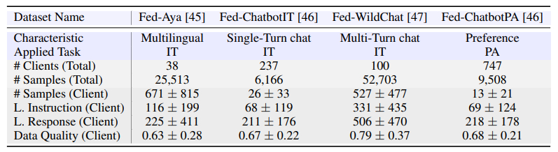

# FedLLM-Bench: Realistic Benchmarks for Federated Learning of Large Language Models

**FedLLM-Bench** is the first realistic benchmark for FedLLM community, which is a follow-up of the [OpenFedLLM](https://arxiv.org/abs/2402.06954) framework. Please check our [paper](https://arxiv.org/pdf/2406.04845) for details and the corresponding empirical study.

FedLLM-Bench includes the following key features:
- 3 datasets for **federated instruction tuning** tasks (i.e., *Fed-Aya*, *Fed-ChatbotIT*, and *Fed-WildChat*).
- 1 dataset for **federated preference alignment** task (i.e., *Fed-ChatbotPA*).
- **Diversities** covering *language*, *quality*, *quantity*, *instruction*, *sequence length*, *embedding*, and *preference*.

## Overview
A summary of our four realistic FedLLM datasets. IT denotes instruction tuning and PA denotes preference alignment. # denotes ‘the number of’ and L. denotes ‘the length of’. Our datasets
exhibit diversities in characteristic, task, client number, quantity, length, and quality


## Dataset
The dataset can be downloaded at [data](https://drive.google.com/file/d/1hKv5A0ROmTQQkcsTcYogCUIeF7Ux1pmy/view?usp=sharing). After unzipping the data files, please place it in the "data" directory in the project.

The unfiltered version can be downloaded at [unfiltered data](https://drive.google.com/drive/folders/1hKXunwJA_K1P-Tn8SBl8HYfw9YjhlpIy?usp=sharing). In this version, we only divided the original dataset by clients and performed an initial cleanup. We did not filter clients based on the data volume. You may use and filter this **unfiltered dataset** according to your specific needs. 

## Setup
```
git clone https://github.com/rui-ye/FedLLM-Bench.git
cd FedLLMBench
conda create -n fedllm python=3.10
conda activate fedllm
pip install -r requirements.txt
```

## Training
We provide training scripts under `training_scripts/`. Refer to `training_scripts/README.md` for more details. Try them out from the top-level directory of this repository.

## Evaluation
We provide code for open-ended evaluation in `evaluation/open_ended`, covering MT-Bench, Vicuna Bench, AdvBench and GPT4-refer. Refer to `evaluation/open_ended/README.md` for more details.
## Citation

Please cite our paper if you find the repository helpful.

```
@article{ye2024fedllm,
  title={FedLLM-Bench: Realistic Benchmarks for Federated Learning of Large Language Models},
  author={Ye, Rui and Ge, Rui and Zhu, Xinyu and Chai, Jingyi and Du, Yaxin and Liu, Yang and Wang, Yanfeng and Chen, Siheng},
  journal={arXiv preprint arXiv:2406.04845},
  year={2024}
}
```
and
```
@article{ye2024openfedllm,
  title={OpenFedLLM: Training Large Language Models on Decentralized Private Data via Federated Learning},
  author={Ye, Rui and Wang, Wenhao and Chai, Jingyi and Li, Dihan and Li, Zexi and Xu, Yinda and Du, Yaxin and Wang, Yanfeng and Chen, Siheng},
  journal={arXiv preprint arXiv:2402.06954},
  year={2024}
}
```
